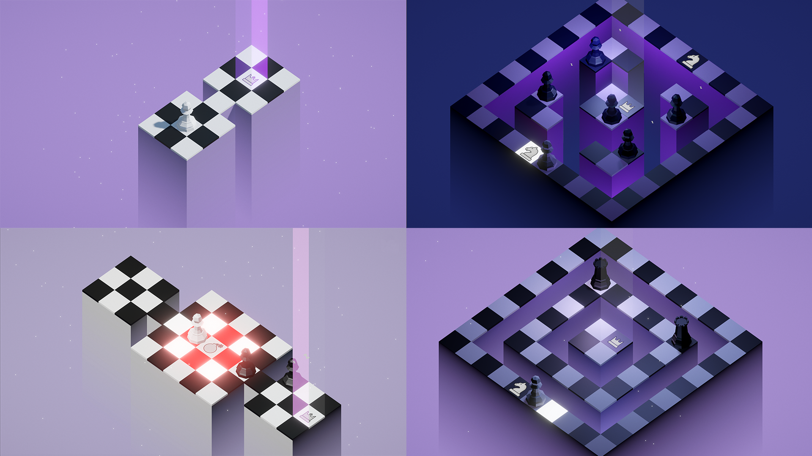

Gambetto is an open-source casual arcade game enriched with puzzle elements, crafted with passion by a team of five MSc Engineering students as part of a university project at Politecnico di Milano. 
Player navigates through dungeon-like levels, facing enemy chess pieces and using power-ups to gain new abilities. 
Currently offering 20 minutes of gameplay, Gambetto serves as a proof of concept. You can play Gambetto downloading executables from [itch.io page](https://polimi-game-collective.itch.io/gambetto) 

We are dedicated to expanding and refining Gambetto.
A tiny architecture overview of the game can be found in the [game design document](Docs/game%20design%20document.md). 

## Contributing

Whether you're looking to fix bugs, add new features, or improve the game with just an idea proposal, your input is valuable to us💙.
Here’s how you can contribute:

1. Fork the project.
2. Create your feature branch (`git checkout -b feature/YourAmazingFeature`).
3. Commit your changes (`git commit -m 'Add some AmazingFeature'`).
4. Push to the branch (`git push origin feature/YourAmazingFeature`).
5. Open a pull request.

If you want to design a Gambetto level check out [guideCSV](Docs/guideCSV.md) in the docs folder: it breaks down how to use CSV files to generate rooms to compose a level. 

## License

Gambetto is licensed under the Apache License, Version 2.0. See [LICENSE](LICENSE) for the full license text.

## Developers/contacts

- Martino Piaggi: [martinopiaggi](https://github.com/martinopiaggi), martino.piaggi@mail.polimi.it
- Lorenzo Morelli: [lorenzo-morelli](https://github.com/lorenzo-morelli), lorenzo1.morelli@mail.polimi.it
- Matteo Laini: [matteolaini](https://github.com/matteolaini), matteo.laini@mail.polimi.it
- Milo Brontesi: [zibasPk](https://github.com/zibasPk), milo.brontesi@mail.polimi.it
- Mario Vallone: [Mario2414](https://github.com/Mario2414), mario.vallone@mail.polimi.it

