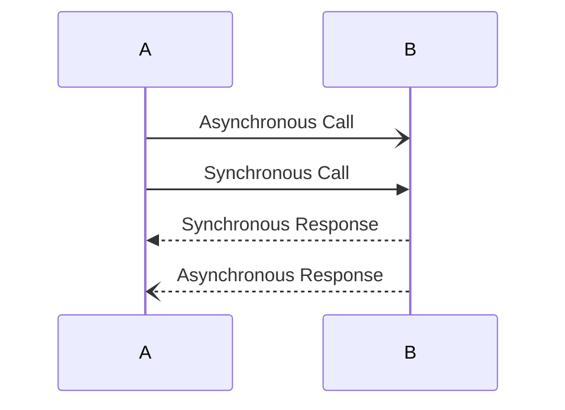
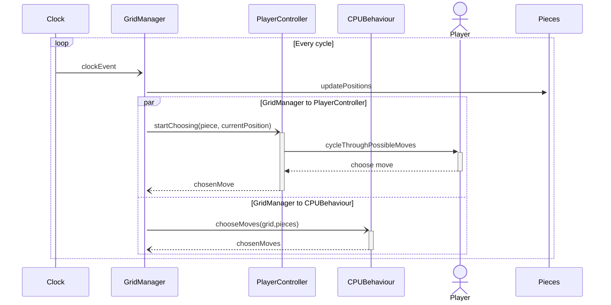

# Gambetto

## Team

- Martino Piaggi: Developer -> [martinopiaggi](https://github.com/martinopiaggi), martino.piaggi@mail.polimi.it
- Lorenzo Morelli: Developer-> [lorenzo-morelli](https://github.com/lorenzo-morelli), lorenzo1.morelli@mail.polimi.it
- Matteo Laini: Developer -> [matteolaini](https://github.com/matteolaini), matteo.laini@mail.polimi.it
- Milo Brontesi: Developer -> [zibasPk](https://github.com/zibasPk), milo.brontesi@mail.polimi.it
- Mario Vallone: Developer -> [Mario2414](https://github.com/Mario2414), mario.vallone@mail.polimi.it

## Overview and Vision Statement

Gambetto combines the strategic depth of chess with puzzle and arcade elements. 
Players take on the role of a chess pawn facing various challenges. As they navigate different types of dungeons, they’ll need to face enemy pieces and get to the end of different rooms. Players can transform using power-ups and gain abilities from other chess pieces, introducing layers of strategy and gameplay depth.
Some pieces in the game will move following a certain rhythm others will chase the player; players will need to time their movements and avoid them.
The player also needs to avoid falling out from the chessboard, otherwise they will have to restart the level.
Levels are designed and ordered with increasing difficulty.
By triggering specific tiles its possible to change some parts of the level.
A level will be considered completed only if the player reaches the end tile.
As a consequence, the next level will be unlocked and playable.

### Genre

Strategy puzzle Hybrid with Arcade elements.

### Platforms

Windows, Mac, Linux

### Market Analysis

The game's visual aesthetics will draw inspiration from Monument Valley while blending puzzle elements with arcade mechanics reminiscent of games like Crossy Road.

## Gameplay

### Game Flow

In a typical game players commence a level in the role of a pawn, and they must strategize their moves by carefully timing their inputs. The available move is visually highlighted on the ground, and changes cycling through an array of moves over a set duration.
Using this game mechanic, players navigate the dungeon, progressing through various levels while avoiding enemy pieces and environmental hazards. Certain rooms contain power-ups essential for progressing through the map. Completion of each level grants access to the next one.

### Core Mechanics

- Chess-inspired Movement: Navigate using the movement rules of chess pieces.
- Movement: Sync your moves with the ticking of an in-game clock. Mistime your move, and face the consequences. Selecting trigger all enemies to move at the same time as the player. Enemy movement will also be triggered by the end of a move cycle.
- Chess Power-ups: tiles representing various chess pieces that allow the player to gain their movement abilities.
- Bomb tile: triggers a timed explosion that will destoy adjacent tiles.
- Key tile: unlocks a new path.
- Quick Levels: Short, intense levels, especially during the initial phases.

### Challenges

- **Time Pressure**: player must make their move within a time limit
  - To be stationary increase the chances to be captured by an enemy piece.
  - Selecting the wrong move can result into falling out from the chessboard or crashing into an enemy piece.
- **Dynamic Enemies**: various types of enemies
  - Different enemies have different move patterns.
  - Enemies move in sync with the player, some try to eat the player others just follow a predefined pattern.
  - Enemies that follow you have an activation distance; they will try to catch you only if you alert them by getting close enough.
- **Special Tile exploitation**: Player must make the most of special tiles
  - Wrong powerups could increase difficulty.

### Level Design

Levels are divided in "worlds" each with an unique aesthetic and a twist to the gameplay.

Each level has different challenges and hazards, levels are made of chess board style tiles and are surrounded by a foggy void.
Levels exhibit unique, intricate shapes and may incorporate openings within their design. They are set apart by alterations in tile patterns, lighting, and fog effects, presenting varying colors to immerse players in diverse environments. Within each room, enemies are strategically positioned, and players will have to find a way to traverse them and reach the end goal, a highlighted tile that "crowns the player as King".

## User Interface

The in-game user interface has a minimalistic design, featuring only a pause button that when clicked shows a menu that allows players to return to the level selection screen, restart the level or go to the settings menu.

## Characters

- The Pawn (Player): The main character who embarks on this journey to become a King, harnessing the powers of other pieces.
- Enemy Pieces: Various chess pieces, each with unique movement patterns, challenge the player throughout the journey.

## Story

In a surreal chess world, a lone pawn seeks to become a king. To do so, it must navigate a maze of challenges and adversaries, learning from other pieces and growing in strength.

## World

The setting is an abstract, ever-changing chessboard. Each level is a unique dungeon challenging the player's spatial awareness.
In each level the player will face a chessboard with different shape compared to the previous one. Lighting and chess board colors may vary too.

## Art and Visual Style

The game's artistic style embraces a Low Poly Minimalist approach, infusing it with a hint of surrealism. Inspired by "Monument Valley".
The game camera will have an isometric view of the map and will follow the player.

## Music

The game's music sets the mood with a light and spacious tone, creating a soothing and immersive experience for players.

## Sound Effects

Discrete, emphasizing movements, captures, transformations and explosions.

## Technical Specification

- **Engine**: Unity.
- **Graphics**: 3D low poly.
- **Controls**: The player can use the space key/mouse click (or screen tap on mobile) to select his move. He needs to press it when the light displayed on the terrain corresponds to his desired direction. Initially the pawn can only move one step in each direction (excluding diagonal moves), but the game will provide some power-ups to increase the variety of the movement. In this last case the player will be also able to select the destination cell always in the unforgiving way that distinguishes the game.

### Project Structure Overview

Materials

- Two distinct chessboard materials: Dark and Light. These are used for the two different colored squares on the chessboard and for all the pieces.
- Background fog.
- Particles materials for dust & rain.
- Transparent material for the end of level light shaft.
- Emissive materials for the selected square & for the higlighted square (only visible if activated in accessibility settings).

Scenes

- A main menu for game navigation.
- Level selector scene.
- Quotes scene.
- All levels divided by category.
- Credits scene.

Scripts

- Main Game Logic:

  - Scripts for audio management, cell interactions, grid management, level flow, main menu functionality.

- Chess Piece Logic:

  - Scripts for the behaviors of chess pieces.

- Enemy Piece Logic:
  - Enemies will calculate their behaviours after each move of the player.
  - There are two different types of enemy pieces:
    - enemies following a pattern, the moves of this type of enemy are predefined by the level designer and will be calculated first. This type of enemies won't react to player movements and will loop on their path.
    - enemies that try to capture the player, the moves of this type of enemy are calculated sequentially using a BFS algorithm in relation to the chosen move of the player. In order to avoid collisions between each other, they have information about the position and chosen moves of all other enemies.
  - Additionally the latter type of enemies can have an activation distance and be "asleep" until the player gets near enough.
- Room Logic:
  Scripts related to room behavior and layout.
  Room designs are stored in .csv files, this allows them to be reused and easily expanded or modified.

- UI Logic:
  Sripts related to buttons, trasitions, toggles & sliders.

- Clock Logic:

  arrow conventions:

   

- Utilities:
  Several utility scripts for constants, debugging, and movement directions, among others. These are crucial for game functionality and development efficiency.

- Sounds:
  Audio files for theme music and sound effects, which will contribute to the game's ambiance and player feedback.

## Assets
- Art
    - 2D
        - UI
            - Pawn_White_Chess_Piece_PNG_Clip_Art-2751.png
            - RoundedRectange.png
            - back_icon.png
            - checkbox.png
            - exitIcon.png
            - feedback_icon.png
            - home_icon.png
            - levels_icon.png
            - next_icon.png
            - pause_icon.png
            - play_icon.png
            - restart_icon.png
            - return_icon.png
            - settings_icon.png
        - bK.png
        - gambettoBomb.png
        - keyGambettoo.png
        - wB.png
        - wK.png
        - wN.png
        - wP.png
        - wQ.png
        - wR.png
    - 3D
        - Bishop.obj
        - King.obj
        - Knight.obj
        - Pawn.obj
        - Queen.obj
        - Rook.obj
    - Animations
        - exlamation-speech-bubble.png
        - sleeping-speech-bubble.png
- Audio
    - OST
        - background1.mp3
        - background2.mp3
        - piano1.mp3
        - piano2.mp3
    - bombExplosion.mp3
    - chosenMove.mp3
    - clock_tick.mp3
    - deathByCollision.ogg
    - deathByFall.wav
    - endLevel.wav
    - gambetto_OST1.wav
    - keyUnlock.wav
    - pawnAlerted.wav
    - powerUp.wav
    - theme.mp3
    - tiptoe.mp3
- Fonts
    - Anta
        - Anta-Regular.ttf
        - OFL.txt
        - README.md
    - Robot Serif
        - RobotoSerif-Light.ttf
        - RobotoSerif-LightItalic.ttf
        - RobotoSerif-Regular.ttf

## Deadlines

### Week 1 (October 10 - October 17, 2023)

- **Team formation and initial brainstorming sessions.**
- **Task Assignment to start game's core mechanics.**

### Week 2 (October 17 - October 24, 2023)

- **Continuing Core Mechanics Development**
- **Aesthetics Brainstorm**
- **Hold a team meeting to discuss progress and potential changes.**

### Week 3-4 (October 24 - November 6, 2023)

- **Experimenting layout of levels**
- **Milestone Review**
- **Draft of GDD**

### Week 5-9 (November 6 - December 12, 2023)

- **Prototype Development**
- **Aesthetics Implementation**
- **Regular Playtesting, testing and refining gameplay mechanics**
- **Prototype Submission** (December 10)

### Week 10 (December 12 - December 20, 2023)

- **Prototype Evaluation**
- **Feedback Gathering**

### Week 11-13 (December 20, 2023 - January 13, 2024)

- **Beta Development**
- **Bug Fixing**

### Week 14-16 (January 13 - February 23, 2024)

- **Beta Testing**
- **Feedback Implementation**

### Week 17 (February 23 - February 27, 2024)

- **Final touches and last-minute refinements.**
- **Submit the final project.**
